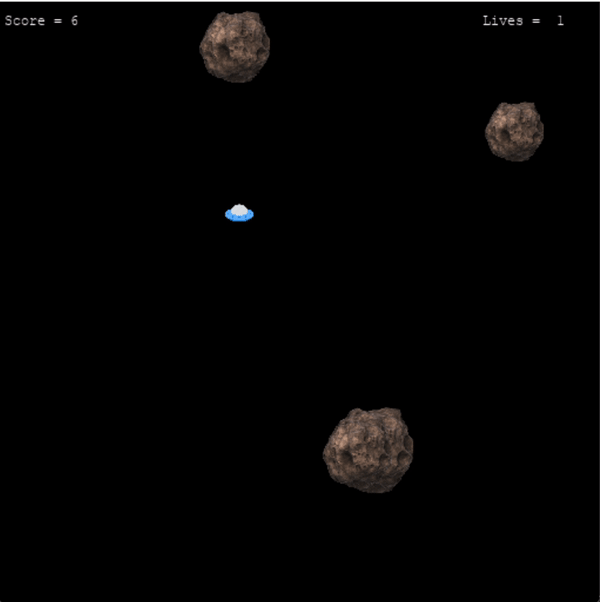
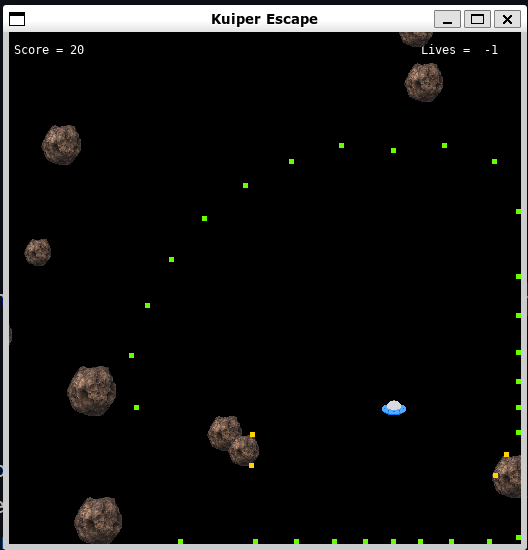
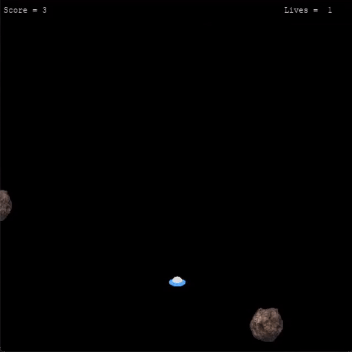
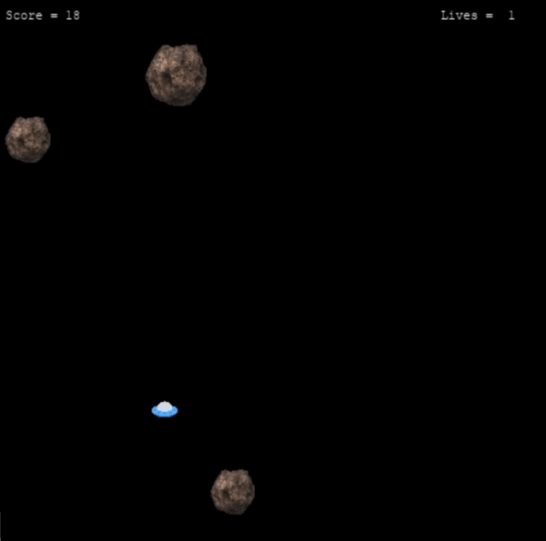
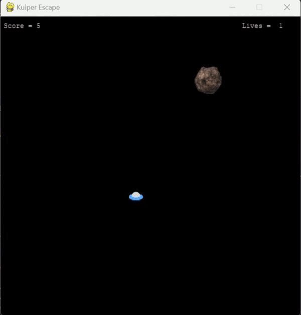
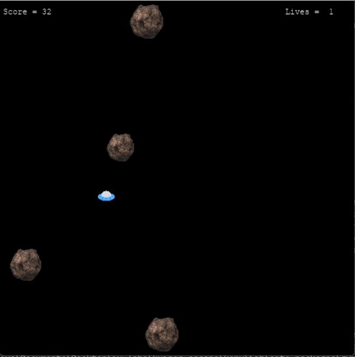
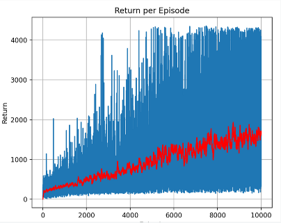
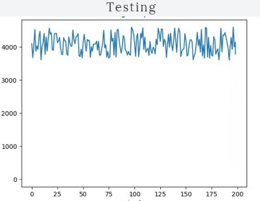

# Kuiper Belt Escape Using Reinforcement Learning

## Project Overview :
In this project, we trained an agent in a challenging and dynamic **Kuiper Escape environment** using the **Q-learning algorithm**. The environment features a **continuous state space**, discretized for optimization, and includes obstacles like rocks that the agent must strategically avoid. The goal is to maximize rewards through efficient exploration and precise navigation.

To know more about the environment follow this repository :  
[Kuiper Escape Environment Documentation](https://github.com/jdegregorio/gym-kuiper-escape)  

## Aim : 
The project aims to simulate and analyze an RL agent’s navigation within a **custom-built Kuiper Belt environment**. The agent learns optimal strategies for:
- **Avoiding obstacles (rocks)**  
- **Maximizing rewards through efficient movement**  

## Kuiper Escape Environment Overview
The environment is a dynamic space populated with asteroids of varying sizes, speeds, and trajectories. The agent, represented as a spaceship, aims to navigate this challenging environment while avoiding collisions.  
The primary objective is to survive for as long as possible, thereby improving its game score and maximizing the total cumulative reward.  

  

## Observation Space
 
The state is a virtual lidar system that emits beams in all directions to capture distances and object characteristics, with a configurable array size and observation space.

The observation data (for each beam in the lidar array):
 * Distance (i.e. radial distance from player to terminating point of lidar beam)
 * Collision detection
   * 0 if terminated at edge of screen, or at max radius distance
   * 1 if collided with a rock

For example, if the number of lidar beams is set to 8, the observation space would be a 16x1 array.  
The observation data might look like this:  
`[0, 0.1, 0.2, 0.3, 0.5, 0.6, 0.2, 0.3 | 0, 1, 0, 0, 0, 1, 0, 1]`  

Here,
- The **first half** (8 elements) represents the normalized distances of obstacles (e.g., rocks) from the agent.
- The **second half** (8 elements) indicates collision status, where 1 represents a collision and 0 represents no collision.

---

## Action Space
The agent has the following discrete set of actions:  

<!--- **0:** Don't move  
- **1:** Up  
- **2:** Right  
- **3:** Down  
- **4:** Left  
-->
| Value | Action     |
|-------|----------- |
| 0     | Don't move |
| 1     | Up         |
| 2     | Right      |
| 3     | Down       | 
| 4     | Left       |

---

## **Reward Function**

The reward function was designed to maximize the agent's survival time in the environment. The key components of the reward function are:  

- A strong **negative reward** was given as a penalty for collisions, discouraging the agent from hitting obstacles.  
- A **positive reward** was defined based on the agent's proximity to the center of the screen. The closer the agent remained to the center, the higher the reward.  

For example, the following reward function, which varies inversely with the distance from the center, was used :

```python
if dist_from_center < 0.35:
    reward = 1 / (0.65 + dist_from_center)
else:
    reward = 0
```
**Note** : The above reward modification was implemented directly in the `step` function of the `env_base` python file of the Kuiper escape environment.  

---
## Learning Process results

Initially, the agent performs random actions, primarily navigating along the edges of the environment. During this phase, it explores the space without a clear strategy, gradually gathering information about its surroundings to inform future decision-making :  

  

As the number of episodes increases, the agent progressively enhances its navigation skills, adopting a more strategic approach to effectively avoid obstacles : 

<div style="display: flex; justify-content: space-between;">
  
  
</div>  


  
After a substantial number of episodes (eg. 12k ) , the agent has acquired sufficient learning, now navigating the environment with skill and precision, effectively avoiding obstacles. Its movements have become increasingly efficient, demonstrating a clear understanding of its surroundings and an enhanced ability to adapt to challenges.  
**Final Results:**

<div style="display: flex; justify-content: space-between;">
  
  
</div>


---

## Algorithm Used : Q-Learning 
Reinforcement learning provides a range of algorithms ideal for solving problems in model-free environments, where the agent lacks prior knowledge of the environment's dynamics.  

For this project, **Q-learning** was chosen as the primary algorithm due to its reliable convergence to the optimal policy over time, especially in simpler environments.  
As an off-policy algorithm, Q-learning learns the optimal policy by considering actions that may not necessarily follow the current policy. This allows for a balanced exploration of the environment while still exploiting the best-known strategies. By using techniques like the **epsilon-greedy strategy**, Q-learning effectively manages the trade-off between exploration and exploitation. Given that Q-learning emphasizes gathering information through exploration, it is well-suited for this project, where the agent must continuously adapt and refine its navigation strategy in a dynamic, unknown environment.
The link for the code has been provided below .

[Implementaion Code](final_implementation.py)


---

## Discretisation of Continuous State space
#### Convergence problem faced with continuous observation space:
Since the observation space in the Kuiper Escape environment was continuous, we encountered a challenge. A continuous environment means there could be a vast number of possible states. The computation of action values for such a large state space and storing them in the Q-table was **computationally infeasible** and would lead to **memory overflow**.

For instance, in a continuous observation space, values like `2.213` and `2.21345` would be treated as different states, which significantly increases the number of states to be stored. This results in an **insufficient Q-table for convergence** due to memory limitations.

#### Solution :
To reduce the computational load, we **discretized** the continuous observation space by dividing it into smaller, finite intervals. This approach allowed the algorithm to learn efficiently without overwhelming computational resources or memory capacity.

---

## Graphical Results :

  


### **Requirements** 🛠️

- **Python 3.8+**
- **Libraries**:
  - `numpy`
  - `matplotlib`
  - `gymnasium`
- **Custom Environment**: `gym_kuiper_escape`
    For setting up environment, one must follow
    [Kuiper Escape Environment Documentation](https://github.com/jdegregorio/gym-kuiper-escape) .
---

### **Future Improvements** 🚀

- Implement **Deep Q-learning (DQN)** to handle larger and more complex environments.
- Explore **reward shaping** techniques for more refined learning.
- Extend the environment to include dynamic obstacles and more complex challenges.
- Optimize the training process for faster convergence and better performance in larger-scale environments.

---


